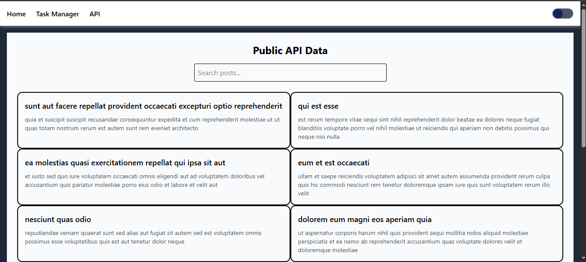

# Full Stack Week 3 Assignment

**Deployed URL:** [https://reactweek3elljah.netlify.app](https://reactweek3elljah.netlify.app)

- ### Technologies Used

- **React (Vite)**
- **Tailwind CSS**
- **React Router DOM**
- **React Icons**
- **Context API & Custom Hooks**
- **Netlify** (Deployment)

---

## Setup Instructions

### 1. Clone the Repository
```bash
git clone https://github.com/YOUR-USERNAME/full-stack-week3-assignment.git
cd full-stack-week3-assignment
```
### 2. Install dependencies 
```bash
  npm install
```
### 3. Run development server
```bash
  npm run dev
```
### 4. Build for production 
```bash
  npm run build
```
### Screenshots

### 🏠 Home Page


### 🧠 Task Manager


### 🌐 API Page

